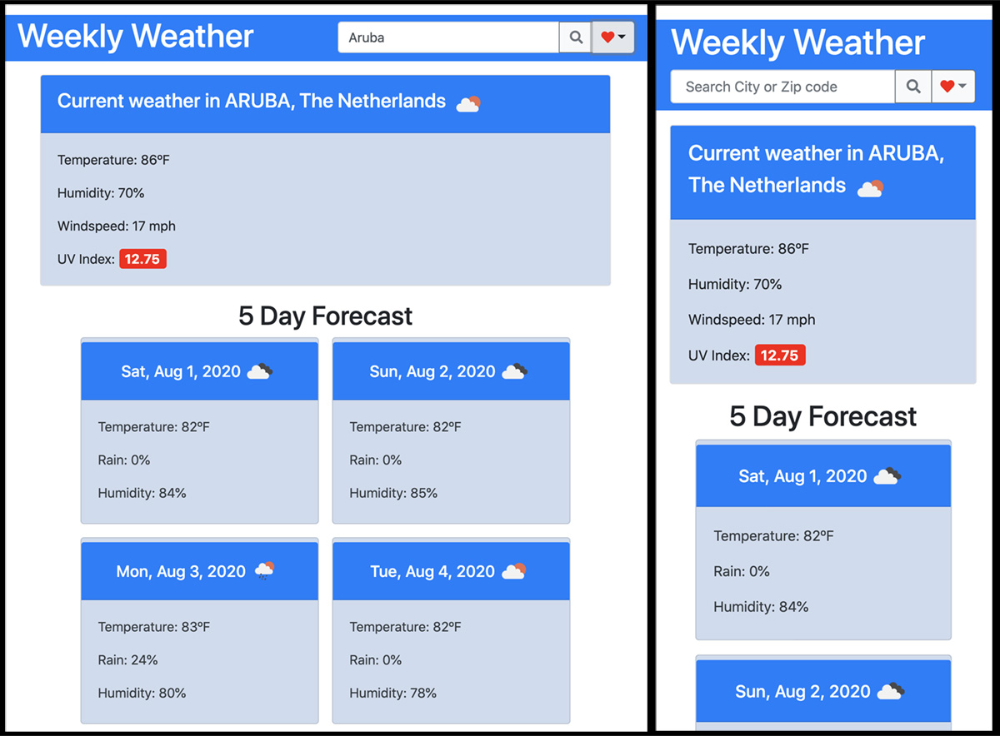
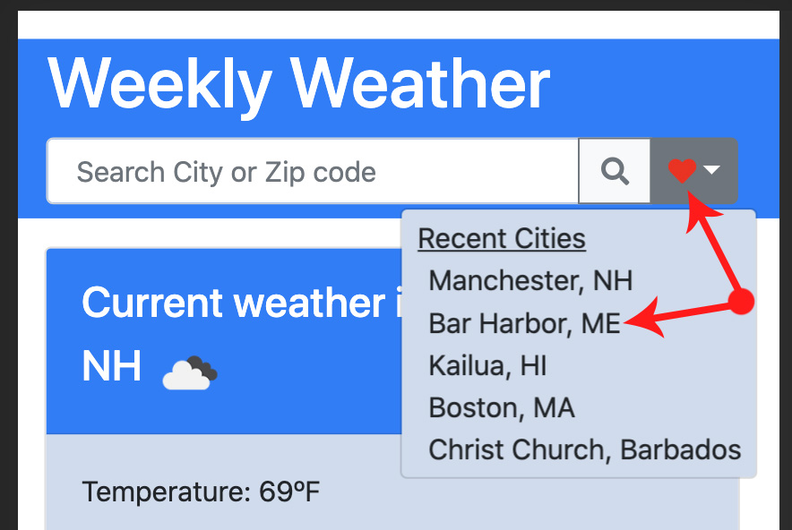

# Weekly-Weather-Widget
Get the 5 day forecast for any city, fast!!
Your last 5 searches are saved in the Favorites dropdown so you can quickly revisit your recent cities.
view app at - https://keiththarp.github.io/weekly-weather-widget/.

## Early Steps

This was a fun exercise and exciting to use an external API for a real practical app.

## Lessons In Coding

Working and becoming more familiar with Jquery and Moment.JS. I also worked on passing values from function to function as arguments.

**Populating the recent cities**

- This took quite a bit of experimenting as I wanted to be sure that the most recent city was listed at the top as well as being the city that loaded upon revisiting the site. I brought in another lesson of using slice() to keep the list of recents to a predetermined length.

**Getting the weather**

- At first I was struggling to get the required elements on the page using just one API call. Thanks to some tips from fellow classmates I realized I was going to need to make more than one call and ended up using two different APIs to get the search to provide the best results

**Mobile First design**

- Using the BootStrap framework helps make the design and final product a mobile friendly app from the beginning.

**Acknowledgments and Credits**

* As always! Thanks to Scott, Mike, & Bobby for being a great and ever patient education team!
* Thanks to Chad for answering questions and steering me toward the GEO API that helped provide the best quality city search results.
* Tons of thanks to the several different study groups that helped keep the problem solving juices flowing this week.
* Many thanks to the usual suspects, Stack Overflow & W3Schools

